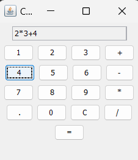
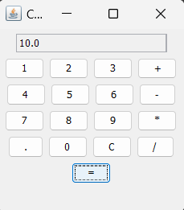

# Calculator Application

## Introduction

The Calculator Application is a simple yet powerful tool developed using Java Swing. It provides an intuitive graphical user interface (GUI) that allows users to perform basic arithmetic operations like addition, subtraction, multiplication, and division. The primary goal of this project is to demonstrate the implementation of a functional GUI application in Java, making it an excellent example for both learning and practical use.

## Description

This calculator is designed to be user-friendly and accessible to individuals of all levels of technical expertise. The application features a clean layout with clearly labeled buttons for numbers, operations, and other functionalities such as clearing the input or calculating the result. The Calculator Application handles real-time input, updates the display as you type, and respects the order of operations to ensure accurate results.

Key features include:
- **Basic Arithmetic Operations**: Perform addition, subtraction, multiplication, and division.
- **Real-Time Display**: Shows the input and ongoing calculation as you enter data.
- **Clear Functionality**: Allows users to reset the current input and start over.
- **Decimal Support**: Handles calculations involving decimal numbers.

The application is a standalone desktop tool that requires no additional dependencies beyond the standard Java runtime, making it easy to set up and use on any machine with Java installed.

## Explanation

The Calculator Application is built using Java Swing, a widely-used framework for creating GUI applications in Java. The main components of the application include:

- **JFrame**: Serves as the main window for the application.
- **JTextField**: Displays the current input and result of the calculations.
- **JButtons**: Represent the numbers, arithmetic operations, and control functions (like clear and equals).

The program logic handles user input by appending numbers and operators to a display string, which is then evaluated based on the user’s actions. The application respects the standard rules of arithmetic, ensuring that multiplication and division are performed before addition and subtraction. This structure not only simplifies the user experience but also serves as a learning tool for those interested in Java GUI development.

## Conclusion

The Calculator Application is a functional and educational project that combines the principles of GUI design and basic arithmetic operation handling in Java. It offers a practical example of how to create a user-friendly interface while managing real-time user inputs and operations. Whether used as a utility tool or as a learning resource, this calculator serves its purpose effectively and provides a solid foundation for further exploration into Java GUI programming.

## Output
Input

Output

